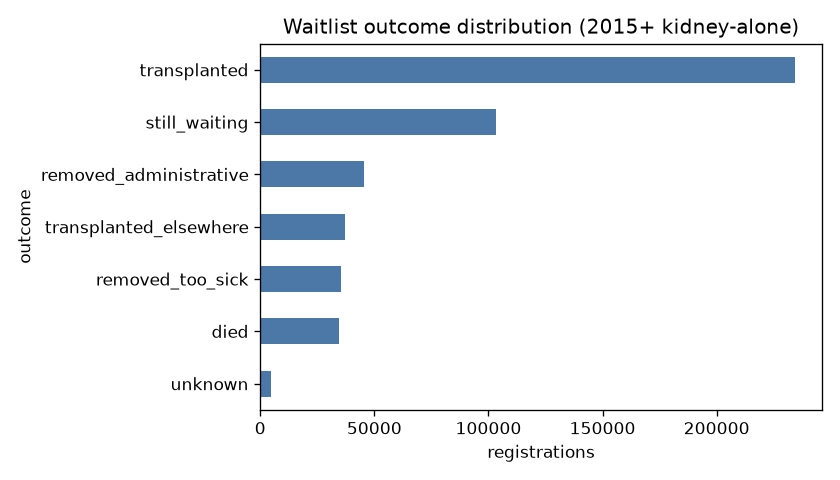
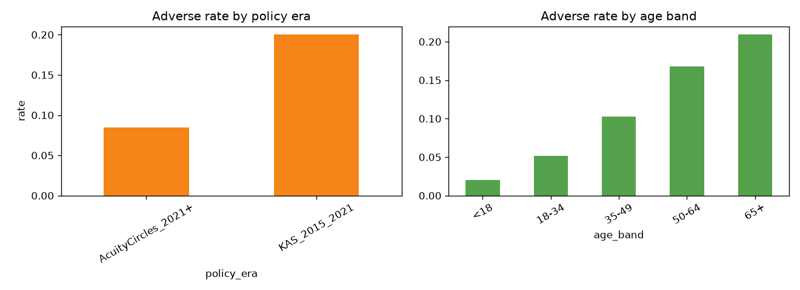
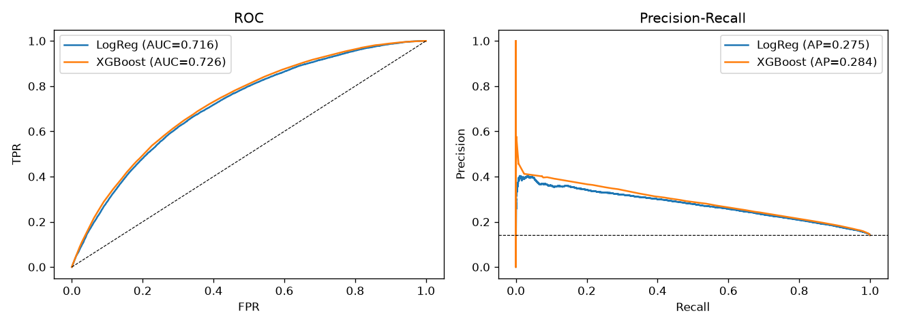
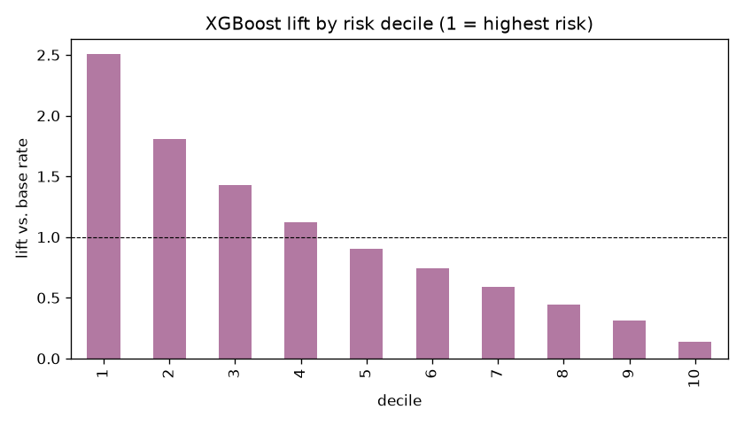
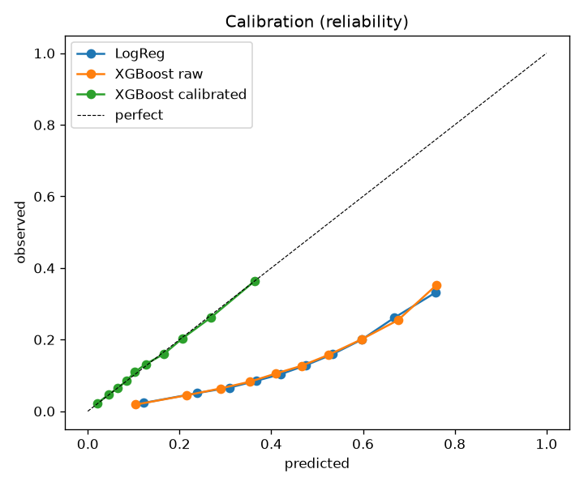
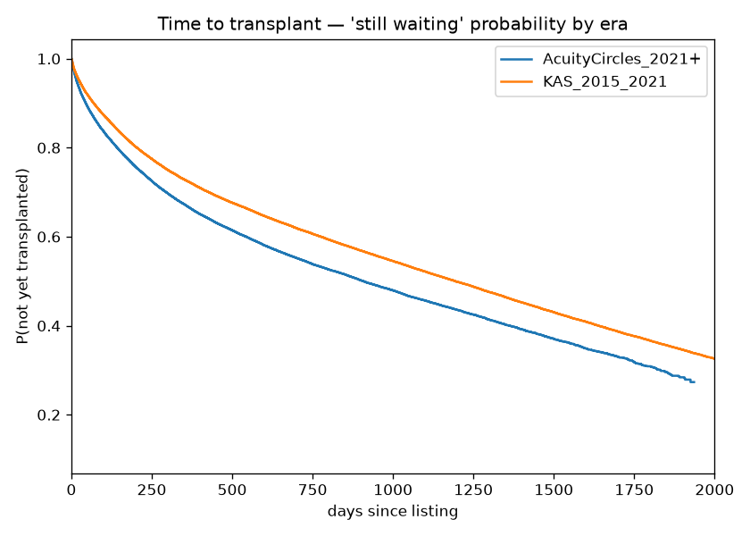
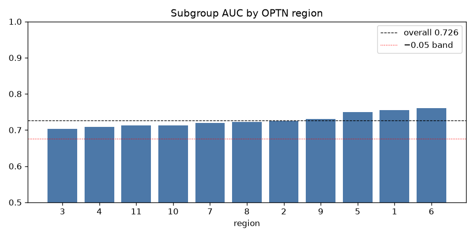
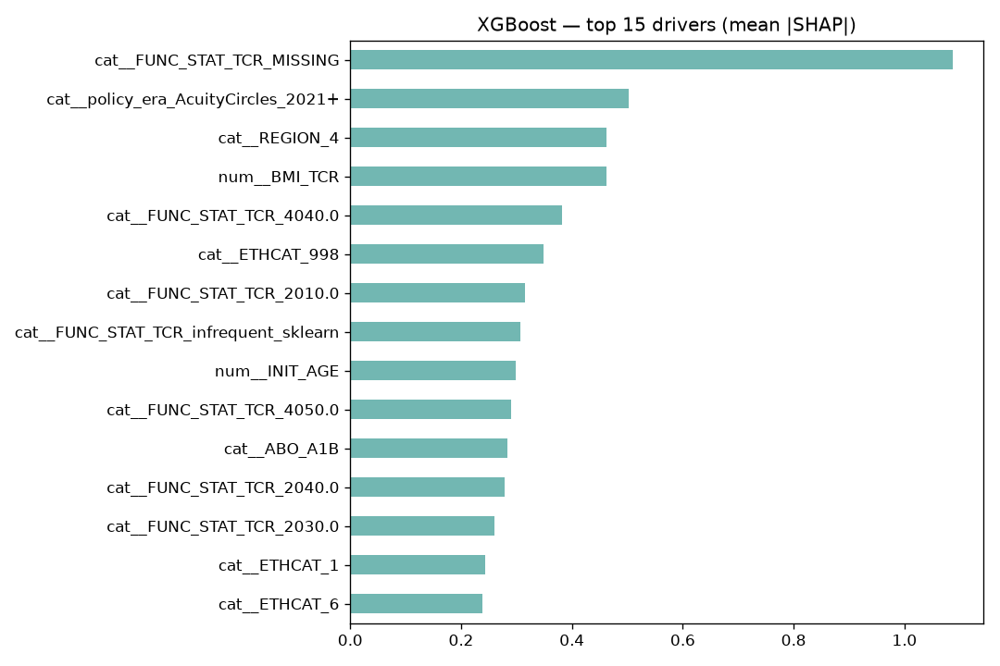

# Predicting Waitlist Risk and Time-to-Transplant for Kidney Candidates: A Reproducible, Fairness-Aware Analysis of OPTN National Registry Data

**Authors:** [Fellowship team — names/affiliations]
**Contact:** [corresponding author]
**Version:** Conference draft, 2026-08-19
**Data release:** OPTN STAR `KIDPAN` file, June 2026 (`202606`)

---

## Abstract

**Background.** Patients on the U.S. kidney transplant waiting list face two intertwined uncertainties: whether they will survive to transplant, and how long they will wait. With more than 90,000 candidates awaiting a kidney but fewer than 30,000 transplants performed annually [1], the supply–demand gap makes waitlist risk stratification clinically consequential. Outcomes are shaped both by patient factors and by a national allocation system that changed materially in 2014 (Kidney Allocation System, KAS [4]) and 2021 (Acuity Circles [5]). We build and audit predictive models for both questions using national registry data, with an explicit emphasis on leakage control, probability calibration, fairness across demographic and geographic subgroups, and reproducibility.

**Methods.** From the OPTN `KIDPAN` Standard Transplant Analysis and Research (STAR) file we constructed a cohort of **494,862 kidney-alone waitlist registrations** listed on or after 1 January 2015. We framed two tasks: (1) a **binary classifier** for an adverse waitlist outcome (death or removal-as-too-sick before transplant; 14.1% prevalence) using **listing-time features only**, and (2) a **time-to-transplant survival model** (Cox proportional hazards) treating death, removal, and administrative censoring as right-censoring. Models were a logistic-regression baseline and a gradient-boosted tree ensemble (XGBoost). We applied **post-hoc isotonic calibration**, evaluated with ROC-AUC, PR-AUC, Brier score, top-decile lift, and Harrell's C-index, audited subgroup AUC against a 0.05 fairness tolerance, and explained the model with SHAP.

**Results.** The calibrated XGBoost classifier achieved ROC-AUC 0.726, PR-AUC 0.284, top-decile lift 2.51×, and — after isotonic calibration — a Brier score of **0.111** (down from 0.212 uncalibrated), meeting the Brier and lift targets while falling short of the aspirational AUC/PR-AUC targets. The Cox model reached a C-index of 0.629 for time-to-transplant, with median observed wait ranging **211–400 days across OPTN regions**. Subgroup AUC gaps stayed within the 0.05 tolerance for sex (0.004), race/ethnicity (0.024), blood type (0.044), region (0.034), and age (0.042). SHAP identified **functional status at listing**, **policy era**, **BMI**, **ethnicity**, and **region** as the leading drivers.

**Conclusion.** With only listing-time registry features, waitlist-risk and wait-time are predictable to a clinically suggestive but not decisive degree. The most consequential methodological findings are that (a) a naïve cohort definition silently collapses the waitlist to transplant recipients, (b) class-imbalance weighting must be paired with calibration before probabilities are trusted, and (c) subgroup parity in AUC coexists with large *absolute* differences in wait time — a fairness signal that ranking metrics alone conceal.

**Keywords:** organ allocation, kidney transplantation, survival analysis, competing risks, calibration, algorithmic fairness, SHAP, OPTN/UNOS, electronic registry.

---

## Plain-Language Summary

**What we did.** We used national records on people waiting for a kidney transplant to build two prediction tools: one that estimates a patient's chance of dying or becoming too sick before a kidney becomes available, and one that estimates how long they will wait.

**Why it matters.** Far more people need a kidney than there are kidneys to give. Many people wait years, and some die waiting. A tool that flags who is most at risk could help care teams focus attention where it is needed most.

**What we found.** Using only information known when a patient joins the list, the model correctly ranks a higher-risk patient above a lower-risk one about **73% of the time**, and its highest-risk 10% of patients have adverse outcomes at about **2.5× the average rate**. After a correction step, the risk percentages it reports are trustworthy (well-calibrated). Predicting *wait time* was harder.

**The catch.** The model performs about equally well for men and women, across races, and across regions — but that hides a real problem: how *long* people wait varies almost two-fold depending on which region they live in. Fair-looking accuracy is not the same as fair access.

**Bottom line.** Waiting-list risk can be predicted moderately well from basic listing information — useful for prioritizing care, but not precise enough to decide who gets an organ, and never a substitute for clinical judgment.

**A note on jargon.** Throughout, *waitlist* = the list of people waiting for a transplant; *censored* = a patient still waiting when we stopped observing, so we don't yet know their final outcome; *calibration* = whether a predicted "20% risk" really happens about 20% of the time; *AUC* = how well the model ranks a riskier patient above a safer one (0.5 = coin-flip, 1.0 = perfect); *SHAP* = a method that shows which patient details pushed a prediction up or down.

---

## 1. Introduction

### 1.1 Clinical problem

End-stage kidney disease is treatable by transplantation, which confers a survival and quality-of-life advantage over long-term dialysis. Demand, however, vastly exceeds supply. As of the 2024 SRTR Annual Data Report, more than 90,000 candidates are awaiting a kidney and new listings reached a record in 2024, while fewer than 30,000 kidney transplants are performed annually (27,759 in 2024) [1], [2]. The consequence is a long, hazardous wait: many candidates die or deteriorate to the point of being removed as "too sick to transplant" before an organ is offered. Pretransplant mortality varies widely by geography — on the order of 2.5–7.0 deaths per 100 patient-years across donation service areas [1] — and a reliable *median* waiting time can no longer be computed because fewer than half of listed candidates are transplanted in a given year; historically it approached four years [1].

Two operational questions follow directly for clinicians and candidates:

1. **Who is at risk?** Which candidates are most likely to die or be removed before transplant?
2. **How long will they wait?** What is the expected time to transplant, accounting for candidates still waiting when observation ends?

A third question governs whether any resulting model should be trusted or deployed:

3. **Is the model fair and explainable?** Does performance hold across demographic and geographic subgroups, and can its drivers be stated in plain clinical language?

### 1.2 Why the problem is hard

This problem is harder than it looks, for five reasons. **(1) The two questions are linked** — how likely someone is to die on the list depends on how long they have to wait. **(2) The rules keep changing.** Two national policy reforms — KAS in 2014 [4] and Acuity Circles in 2021 [5] — changed how kidneys are handed out, so a model trained across those years is aiming at a moving target. **(3) Many outcomes are still unknown.** A large share of patients are still waiting when the data are pulled (statisticians call this *censored*), and transplant, death, and removal compete with one another — a patient who dies can never be transplanted [8]. **(4) The bad event is rare.** Far fewer people have a bad outcome than get transplanted, so plain "accuracy" looks deceptively good. **(5) The biggest trap:** a model can score well simply by memorizing who *historically* got transplants — including the system's racial and geographic unfairness [9], [10], [11] — instead of learning real medical risk. For these reasons we treat data leakage, censoring, competing risks, calibration, and fairness as core design choices rather than afterthoughts.

### 1.3 Contributions

- A **carefully defined kidney-alone waitlist cohort** from the OPTN `KIDPAN` Standard Transplant Analysis and Research (STAR) file, with the cohort-construction pitfalls documented (Section 3.3) so they are not silently repeated.
- A **leakage-controlled** classification model using only variables known at listing, and an explicit enumeration of the transplant-record fields that must be excluded.
- A demonstration that **post-hoc isotonic calibration** repairs the Brier-score damage caused by class-imbalance weighting (0.212 → 0.111) without altering ranking performance, echoing calibration's status as the "Achilles heel" of clinical prediction [12], [13].
- A **fairness audit** showing that subgroup-AUC parity within 0.05 can coexist with large absolute wait-time disparities, and a discussion of why that distinction matters for equity [9], [10].
- Full **reproducibility artifacts**: extract script, analysis pipeline, and aggregate-only outputs compatible with the governing Data Use Agreement.

---

## 2. Background and Related Work

### 2.1 Kidney allocation and policy shifts

U.S. deceased-donor kidney allocation is administered by the Organ Procurement and Transplantation Network (OPTN) under contract to HRSA, operated by UNOS. Two reforms bound our study period. The **Kidney Allocation System (KAS)**, effective 4 December 2014, replaced a largely first-come/first-served scheme with longevity matching (top-20% KDPI kidneys directed to top-20% EPTS candidates), backdating of waiting time to dialysis initiation, and additional priority for highly sensitized (high-CPRA) and blood-type-B candidates [4]. **Acuity Circles**, effective 15 March 2021, eliminated Donation Service Area and OPTN region as units of distribution, replacing them with fixed-distance concentric circles (first unit: a 250-nautical-mile radius around the donor hospital), with the goal of reducing geographic inequity [5]. Because allocation logic changes the feature-to-outcome mapping, a model spanning these boundaries risks **distribution shift**; we therefore encode policy era as a feature and analyze it directly.

### 2.2 Predictive modeling of transplant outcomes

Machine learning has been applied extensively to transplant outcomes, though more often to post-transplant graft/patient survival than to waitlist risk. Senanayake *et al.* [7] systematically reviewed 18 predictive models for kidney graft failure, finding tree-based methods most common but noting that only one modeled time-to-event and that heterogeneity limited comparability. For the waitlist specifically, Salehinejad *et al.* [6] used an ensemble of random forests, XGBoost, and extra-trees to predict kidney-waitlist mortality, reporting that adding an abdominal-arterial-calcification score raised accuracy from 68% to 78% — evidence both that ML is applicable here and that listing-time features alone leave substantial residual uncertainty. Our study differs from prior work in three respects: strict listing-time feature hygiene to prevent leakage, calibration as a first-class deliverable, and an explicit subgroup-fairness audit.

### 2.3 Survival analysis and competing risks

The Scientific Registry of Transplant Recipients (SRTR) publishes national outcome reports [1], and the statistical literature has repeatedly cautioned that waitlist analyses must respect competing risks. Sapir-Pichhadze *et al.* [8] provide a tutorial specifically for waitlisted kidney candidates, contrasting cause-specific hazard models with the Fine–Gray subdistribution model [15] and showing that the choice materially changes conclusions. We adopt a cause-specific Cox model [14] for time-to-transplant and flag Fine–Gray as the recommended extension (Section 6).

### 2.4 Fairness and equity in kidney transplantation

Access to kidney transplantation is known to be inequitable along racial lines. Ku *et al.* [10] showed that the race-adjusted eGFR equation delayed Black patients' eligibility for preemptive waitlisting, and Inker *et al.* [11] subsequently developed race-free eGFR equations now widely adopted. More broadly, Obermeyer *et al.* [9] demonstrated that a widely used clinical risk algorithm encoded substantial racial bias because it optimized a biased proxy (cost) rather than illness. These findings motivate our central fairness concern: a waitlist-risk model that predicts well may simply be reproducing an inequitable allocation history, and subgroup *ranking* parity does not guarantee *outcome* equity.

### 2.5 Calibration and explainability

Van Calster *et al.* [12], [13] argue that calibration — the agreement between predicted probabilities and observed frequencies — is the most neglected yet decision-critical property of clinical prediction models. We treat it as a required deliverable and use isotonic regression to repair the miscalibration induced by imbalance weighting. For interpretability we use SHAP [17], a game-theoretic attribution method with a consistent additive-feature-importance guarantee, computed via XGBoost's [16] native contribution output.

---

## 3. Data

### 3.1 Source

The OPTN STAR files are the de-identified national research extracts of the transplant registry, governed by a Data Use Agreement (DUA). We used the combined kidney–pancreas file, `KIDPAN_DATA.DAT`, from the June 2026 release: **1,303,788 records × 475 variables**, delivered as tab-delimited text with an accompanying SAS-format data dictionary (`KIDPAN_DATA.htm`). The registry spans registrations back to 1987; our working scope is deliberately narrower (Section 3.2) to keep preprocessing tractable and the cohort clinically coherent.

### 3.2 Cohort definition

We restricted to **kidney-alone waitlist registrations listed on or after 1 January 2015**:

- **Organ:** waitlisted-organ field `WL_ORG == "KI"`. This excludes simultaneous kidney–pancreas (`KP`), pancreas-alone (`PA`), and islet (`PI`) registrations.
- **Listing window:** `INIT_DATE >= 2015-01-01`, keeping the cohort within the post-KAS era and spanning the 2021 Acuity Circles transition.

The 2015 lower bound is a scope choice, not a data limit; it concentrates the analysis on the current allocation regime and avoids spending the study on legacy-era preprocessing. The resulting cohort is **494,862 registrations**.

### 3.3 Extract construction and data-engineering pitfalls

Three properties of the STAR file materially affect correctness and are documented here because each can silently corrupt an analysis:

1. **No header row.** The `.DAT` file carries data from the first line; column names live only in the sibling `.htm` dictionary (475 ordered variables). Column names must be attached from the dictionary, not inferred from the file.
2. **Cohort-defining field.** The waitlisted organ is `WL_ORG`; the *transplanted* organ `ORGAN` is null until a transplant occurs (missing for 47% of rows — exactly the non-transplant rate). **Filtering the "waitlist" on `ORGAN` silently collapses the cohort to transplant recipients**, producing a spurious ~100%-transplanted population. We filter on `WL_ORG`.
3. **Missing-value sentinel.** STAR encodes missing values as `"."`. Read literally, `"."` defeats null-aware logic (e.g., a still-waiting candidate's blank removal code would not register as missing). We map `"."` to `NA` on ingest.

The extract retains 34 analysis variables plus five derived fields (`outcome`, `event_adverse`, `event_transplant`, `censored`, `days_to_event`) and is written as aggregates/CSV without redistribution outside the team, per the DUA.

### 3.4 Analytic data dictionary

The `KIDPAN` file carries 475 variables; we retain 34 and derive 5. Each column below is tagged by its **role**: *ID* (linkage key, not modeled), *cohort* (used to define/subset the population), *feature* (a listing-time model input), *outcome* (used to build the label), *leaky* (known only at/after transplant — excluded from models, see §3.7), or *derived*.

| Variable | Definition | Role |
|---|---|---|
| `PT_CODE` | Encrypted patient ID; tracks a person across multiple listings | ID |
| `WL_ID_CODE` | Encrypted waitlist-registration ID | ID / waitlist filter |
| `TRR_ID_CODE` | Encrypted transplant-event ID | ID (transplant-time) |
| `DONOR_ID` | Encrypted donor ID | ID (transplant-time) |
| `WL_ORG` | Organ the candidate is **waitlisted** for (KI, KP, PA, PI) | **cohort key** |
| `ORGAN` | Organ actually **transplanted** (null until transplant) | leaky |
| `WLKI` | "Listed for kidney" flag (mostly null in this cohort) | unused |
| `INIT_DATE` | Date placed on the waiting list | cohort window + time origin |
| `END_DATE` | Date the registration ended (removal/transplant/death/cutoff) | time-to-event |
| `REM_CD` | Reason the registration ended (removal code) | **primary outcome source** |
| `INIT_AGE` | Age (years) at listing | feature (numeric) |
| `GENDER` | Sex (M/F) | feature (categorical) |
| `ETHCAT` | Race/ethnicity category code | feature (categorical) |
| `ABO` | Blood group at registration (O, A, B, AB, subtypes) | feature (categorical) |
| `INIT_CPRA` | Calculated panel-reactive antibody % at listing (sensitization) | feature (numeric) |
| `ON_DIALYSIS` | On dialysis at listing (Y/N) | feature (categorical) |
| `BMI_TCR` | Body-mass index at registration | feature (numeric) |
| `FUNC_STAT_TCR` | Functional-status code at registration (Karnofsky-style) | feature (categorical) |
| `INIT_STAT` | Initial medical-urgency status code | feature (categorical) |
| `REGION` | OPTN region (1–11) | feature (categorical) |
| `END_CPRA` | CPRA at removal / end of episode | leaky (end-of-episode) |
| `END_STAT` | Medical-urgency status at removal | leaky (end-of-episode) |
| `DIALYSIS_DATE` | Dialysis start date | descriptive (not a feature) |
| `LISTING_CTR_CODE` | Listing-center code | descriptive (not a feature) |
| `PREV_TX` | Prior-transplant indicator (populated at transplant here) | leaky |
| `DIAG_KI` | Primary kidney diagnosis code (populated at transplant here) | leaky |
| `TX_DATE` | Transplant date | leaky |
| `DON_TY` | Donor type (deceased vs living) | leaky |
| `PTIME` | Patient survival time (days) | leaky |
| `PSTATUS` | Patient status (1 = dead, 0 = alive) | leaky |
| `COMPOSITE_DEATH_DATE` | Best-available death date | leaky |
| `DAYSWAIT_CHRON` | Total days on the list incl. inactive time | descriptive |
| `DAYSWAIT_ALLOC` | Days counted toward allocation priority | descriptive |
| `MULTIORG`, `A2A2B_ELIGIBILITY` | Multi-organ / A2→B eligibility flags (mostly null) | unused |
| `outcome` | Coarse outcome bucket derived from `REM_CD` (§3.6) | derived (label source) |
| `event_adverse` | 1 if `died` or `removed_too_sick`, else 0 | derived (**classification target**) |
| `event_transplant` | 1 if `transplanted`, else 0 | derived (**survival event**) |
| `censored` | 1 if `still_waiting` at window end | derived (survival censoring) |
| `days_to_event` | `END_DATE − INIT_DATE` in days | derived (survival duration) |

### 3.5 Data-preparation pipeline (raw → analytic extract)

The full pipeline is implemented in `build_analytic_extract.py` (cohort) and `run_analysis.py` (modeling prep). It proceeds in ten steps:

1. **Attach the schema.** The `.DAT` has no header, so parse the 475 ordered variable names from the sibling `KIDPAN_DATA.htm` dictionary and read the file with `header=None` + those names, under `latin-1` encoding.
2. **Stream in chunks.** Read the 1.4 GB / 1.3 M-row file in 100 k-row chunks to bound memory; keep only the columns of interest.
3. **Normalize missingness.** Map the STAR sentinel `"."` to `NA` on read, so null-aware logic behaves.
4. **Restrict to waitlist registrations.** Keep rows with a registration ID (`WL_ID_CODE` present).
5. **Subset the cohort.** Keep `WL_ORG == "KI"` (kidney-alone) **and** `INIT_DATE ≥ 2015-01-01`.
6. **Parse dates & durations.** Parse `INIT_DATE`/`END_DATE`; compute `days_to_event`; null out 59 negative durations (end-before-start data-entry errors).
7. **Derive the outcome.** Map `REM_CD` to the outcome bucket and the `event_*` / `censored` flags (§3.6).
8. **Project columns.** Retain the 34 analysis variables + 5 derived fields → analytic extract (**494,862 × 39**), written to CSV with a column manifest and QA summary.
9. **Leakage screen (modeling).** Drop transplant-time/end-of-episode columns tagged *leaky* above, leaving **11 listing-time features** (§3.7).
10. **Preprocess for models.** Numeric features: median-impute + standardize. Categorical features: impute an explicit `MISSING` level + one-hot encode (categories with < 50 occurrences grouped).

The cohort funnel:

| Stage | Rows |
|---|---:|
| Raw `KIDPAN` registrations | 1,303,788 |
| After kidney-alone + 2015+ waitlist subset | **494,862** |

### 3.6 Outcome definition

The primary outcome source is the waitlist removal code `REM_CD`, mapped to coarse buckets (full mapping in Appendix A):

| Bucket | `REM_CD` codes | Interpretation |
|---|---|---|
| transplanted | 2, 4, 15, 18, 19, 41–45 | received a transplant (this registration) |
| died | 8, 21, 23 | died on the waiting list |
| removed_too_sick | 5, 13 | removed as too sick to transplant |
| transplanted_elsewhere | 3, 14, 22 | transplanted at another center / registration |
| removed_administrative | 7, 9, 10, 11, 16, 17, 20, 24, 40 | administrative / non-clinical removal |
| still_waiting | missing `REM_CD` | right-censored at window end |

The **classification target** is a composite adverse outcome, `event_adverse = 1` if the bucket is `died` or `removed_too_sick`, else 0. The **survival event** is `event_transplant = 1` for `transplanted`, else censored. `days_to_event = END_DATE − INIT_DATE`; 59 rows with negative durations (data-entry errors) were set to missing.

Observed outcome distribution (n = 494,862):

| outcome | n | share |
|---|---:|---:|
| transplanted | 234,429 | 47.4% |
| still_waiting | 103,300 | 20.9% |
| removed_administrative | 45,332 | 9.2% |
| transplanted_elsewhere | 37,243 | 7.5% |
| removed_too_sick | 35,219 | 7.1% |
| died | 34,524 | 7.0% |
| unknown | 4,815 | 1.0% |
| **adverse (died + too-sick)** | **69,743** | **14.1%** |

### 3.7 Feature set and leakage control

Only variables **knowable at the time of listing** are eligible as features. Critically, a cluster of columns in this file is populated **only at transplant** — their missingness (~53%) equals the non-transplant rate — and using them would leak the outcome. **Excluded as leaky:** `DIAG_KI`, `PREV_TX`, `ORGAN`, `DON_TY`, `PSTATUS`, `PTIME`, `TX_DATE`, `DONOR_ID`, `TRR_ID_CODE`, and all `END_*`, `DAYSWAIT_*`, and `COMPOSITE_DEATH_DATE` fields.

The retained **11 listing-time features**:

| type | features |
|---|---|
| numeric | `INIT_AGE`, `INIT_CPRA` (calculated PRA at listing), `BMI_TCR` |
| categorical | `GENDER`, `ETHCAT` (race/ethnicity), `ABO` (blood type), `ON_DIALYSIS`, `FUNC_STAT_TCR` (functional status), `INIT_STAT` (initial medical-urgency status), `REGION` (OPTN region), `policy_era` |

`policy_era` is derived from `INIT_DATE`: `AcuityCircles_2021+` if listed on/after 15 March 2021, else `KAS_2015_2021`.

### 3.8 Missingness

Feature missingness is low except for sensitization: `INIT_CPRA` 28.8%, `FUNC_STAT_TCR` 0.8%, `BMI_TCR` 0.3%; the remaining features are effectively complete. Numeric features were median-imputed; categorical features used an explicit `MISSING` level so that "not recorded" is itself a modelable signal rather than silently dropped.

---

## 4. Methods

### 4.1 Problem formulation

- **Classification (Q1).** Predict `event_adverse` from listing-time features. Positive prevalence 14.1% (imbalanced), so PR-AUC and calibration lead the evaluation, with ROC-AUC reported for comparability.
- **Survival (Q2).** Model time from listing to transplant. Non-transplant terminations (death, removal, still-waiting) are treated as right-censoring; this yields a **cause-specific** time-to-transplant hazard, with the competing-risks caveat discussed in Section 6.

### 4.2 Preprocessing

A single `ColumnTransformer` applied median imputation + standardization to numeric features and most-frequent imputation + one-hot encoding (rare levels < 50 grouped) to categoricals. The same transformer definition was reused across models to keep comparisons clean.

### 4.3 Classification models

- **Logistic regression** (baseline): L2-regularized, `class_weight="balanced"`, 2,000 max iterations.
- **XGBoost** [16]: 400 trees, depth 5, learning rate 0.05, subsample 0.8, colsample 0.8, `scale_pos_weight` set to the negative/positive ratio, objective tuned to `aucpr`.

**Split.** Stratified 75/25 train/test. The training portion was further split 80/20 into a model-fit set and a **calibration hold-out** (Section 4.4). The test set was never used for fitting or calibration.

### 4.4 Post-hoc calibration

Class-imbalance weighting (`scale_pos_weight`) improves minority-class recall but **inflates predicted probabilities**, harming the Brier score and reliability — the calibration failure mode emphasized by Van Calster *et al.* [12], [13]. We therefore fit an **isotonic regression** on the calibration hold-out mapping raw XGBoost scores to empirical frequencies, and applied it to the test set. Because isotonic regression is **monotonic**, it leaves rank-order metrics (ROC-AUC, PR-AUC, lift) unchanged while correcting probability magnitudes.

### 4.5 Evaluation metrics

ROC-AUC; PR-AUC (baseline = prevalence); Brier score (lower better); lift in the top risk decile; and, for survival, **Harrell's C-index** [18]. Calibration is shown as reliability curves (quantile-binned).

### 4.6 Fairness audit

For the final XGBoost model we computed **subgroup ROC-AUC** across sex, race/ethnicity, blood type, OPTN region, and age band, reporting each subgroup's gap versus the overall test AUC. The success tolerance is **|gap| ≤ 0.05**. Subgroups with < 500 members or a single outcome class were suppressed.

### 4.7 Explainability

Global attribution used **SHAP** [17] via XGBoost's native `pred_contribs` on a 4,000-row test sample, summarized as mean |SHAP| (average impact on the log-odds of an adverse outcome).

### 4.8 Assumptions (explicit)

We state assumptions plainly so reviewers can weigh them:

1. **Registration is the unit of analysis**, not the patient. A patient listed at multiple centers contributes multiple rows; we did not de-duplicate to the patient level, so estimates are per-registration.
2. **`REM_CD` mapping is a working hypothesis.** The bucket assignments (Appendix A) approximate the dictionary's REMCD format; multi-listing and administrative codes in particular warrant validation before clinical use.
3. **`transplanted_elsewhere` is treated as a non-adverse, non-event outcome.** It is neither an observed failure of this registration nor a transplant we allocated; it is effectively an informative removal, which we do not model as a competing event here.
4. **Right-censoring is assumed non-informative** for the survival model — i.e., censoring is unrelated to the transplant hazard given covariates. This is imperfect (sicker patients are removed), motivating the competing-risks extension.
5. **The classifier's negative label includes still-waiting candidates**, some of whom will later experience an adverse event. This biases the classifier conservatively; the survival model is the principled complement.
6. **Cross-sectional listing features are static.** We use values recorded at registration and do not incorporate time-varying updates (e.g., changing CPRA, status, or dialysis vintage).
7. **`policy_era` is a proxy** for allocation regime by listing date; it does not capture within-era policy nuance or local OPO behavior.
8. **Random train/test split** assumes exchangeability across the period; a temporal split (train pre-2021, test post-2021) is the stricter stress test and is proposed as future work.
9. **The 150k sub-sample for Cox** is assumed representative of the full cohort for C-index estimation; it was drawn at random with a fixed seed.
10. **Missing-as-signal:** encoding `MISSING` as a category assumes missingness carries information (often true in registries), which can introduce site-specific artifacts.

### 4.9 Reproducibility and implementation

Python 3.12 in an isolated virtual environment. Libraries: pandas 2.3, scikit-learn 1.9, XGBoost 3.4, lifelines 0.30, SHAP 0.49, matplotlib. All randomness fixed (`random_state = 42`). Two scripts reproduce the study end-to-end: `build_analytic_extract.py` (cohort construction from the STAR file) and `run_analysis.py` (EDA → models → fairness → SHAP → report). **Only aggregates and figures are emitted; no row-level records are written or shared**, consistent with the DUA.

---

## 5. Results

### 5.1 Cohort and outcomes

The cohort of 494,862 kidney-alone registrations (Section 3.6) shows 47.4% transplanted, 20.9% still waiting at window end, and 14.1% experiencing the adverse composite (death or too-sick removal). Adverse rate rises with age and differs by policy era.

### 5.2 Classification — who is at risk?

| model | ROC-AUC | PR-AUC | Brier | Lift@top-decile |
|---|---:|---:|---:|---:|
| Logistic Regression | 0.716 | 0.275 | 0.218 | 2.35× |
| **XGBoost (isotonic-calibrated)** | **0.726** | **0.284** | **0.111** | **2.51×** |

Test-set prevalence 14.1% (PR-AUC baseline). Against the aspirational success targets:

| metric | target | achieved (XGBoost) | met? |
|---|---:|---:|:--:|
| ROC-AUC | ≥ 0.78 | 0.726 | ✗ |
| PR-AUC | ≥ 0.65 | 0.284 | ✗ |
| Brier | ≤ 0.18 | **0.111** | ✓ |
| Lift@decile | ≥ 2.5 | **2.51×** | ✓ |

The top-decile lift of 2.51× means the model's highest-risk 10% of candidates experience adverse outcomes at ~2.5× the base rate — an operationally useful concentration for prioritizing supportive care or review, even where absolute discrimination is modest.

### 5.3 Calibration

Isotonic calibration reduced the XGBoost Brier score from **0.212 (raw) to 0.111**, moving it from failing to comfortably within the ≤ 0.18 target. The reliability curve shows the raw model systematically over-predicting risk (a direct consequence of `scale_pos_weight`), with the calibrated curve tracking the diagonal. Rank metrics were unchanged, confirming the calibration was a pure probability-magnitude correction.

### 5.4 Survival — how long until transplant?

The Cox proportional-hazards model achieved a **C-index of 0.629** for time-to-transplant (below the 0.72 target). Among transplanted candidates, **median observed days-to-transplant ranged 211–400 across OPTN regions** — a nearly two-fold geographic spread. Kaplan–Meier curves by policy era visualize the shift in the "not-yet-transplanted" probability over time.

### 5.5 Fairness audit

Overall test AUC 0.726. All audited dimensions stayed within the 0.05 subgroup-AUC tolerance:

| dimension | worst subgroup (AUC) | best subgroup (AUC) | max gap | within 0.05? |
|---|---|---|---:|:--:|
| Sex | M/F ≈ 0.72–0.73 | — | 0.004 | ✓ |
| Race/ethnicity | Black 0.703 | Hispanic 0.749 | 0.024 | ✓ |
| Blood type | A1 0.683 | O 0.731 | 0.044 | ✓ |
| OPTN region | Region 3 = 0.703 | Region 6 = 0.761 | 0.034 | ✓ |
| Age band | 35–49 = 0.685 | < 35 = 0.719 | 0.042 | ✓ |

Two caveats temper the green checks. First, the largest gaps (blood type A1, older age bands) approach the tolerance and rest on smaller subgroups. Second — and more important — **AUC parity is a statement about ranking within a subgroup, not about equal outcomes across subgroups.** The 211–400-day regional wait-time spread (Section 5.4) is a substantive equity concern that AUC parity does not capture (Section 6).

### 5.6 Explainability

The dominant drivers of predicted adverse risk (mean |SHAP|) were, in order: **functional status at listing** (`FUNC_STAT_TCR`, by a wide margin), **policy era** (Acuity Circles), **BMI**, **race/ethnicity**, **OPTN region**, and **blood type**. The primacy of functional status is clinically coherent — impaired functional status is an established predictor of waitlist mortality — and reassuring in that the top driver is a clinical variable rather than a purely administrative one. Region and policy-era prominence, however, indicate the model is partly learning **system and geography**, which is the crux of the fairness discussion below.

---

## 6. Discussion

**Why performance falls short of the aspirational AUC targets — and why that is informative.** With only 11 listing-time features, the model cannot see the strongest determinants of both risk and wait time: HLA matching and sensitization dynamics, KDPI of available donors, dialysis vintage, dynamic CPRA, local OPO behavior, and comorbidity burden beyond a single functional-status code. The registry contains richer signals, but many are transplant-time (and thus leaky) or absent from this extract. The honest reading is that **waitlist risk is only moderately predictable from listing-time demographics and coarse clinical status**; a complex model that barely outperforms logistic regression (0.726 vs 0.716 ROC-AUC) is itself a finding — most of the separable signal is captured by simple main effects.

**Calibration matters more than the AUC gap for deployment.** A model used to *prioritize* candidates needs trustworthy probabilities, not just correct ordering. The 0.212 → 0.111 Brier improvement is the difference between a model that says "everyone is high-risk" and one whose stated probabilities match observed frequencies. We argue calibration should be a required deliverable, not an afterthought, whenever class-imbalance weighting is used.

**Fairness: ranking parity vs. allocation equity.** The subgroup-AUC audit passes, but the more consequential disparity is in *access*: median wait varies up to two-fold by region, and region/policy-era rank among the model's top drivers. A model that predicts risk well within every subgroup can still encode and perpetuate an inequitable allocation geography — the same failure mode Obermeyer *et al.* [9] documented when an algorithm optimized a biased proxy, and the same access inequity that motivated race-free eGFR reform [10], [11]. We therefore recommend reporting **absolute outcome disparities alongside AUC parity**, and treating geographic drivers with suspicion in any deployed risk score.

**Competing risks.** Treating death/removal as censoring for the time-to-transplant model overstates transplant probability, because a candidate who dies can never be transplanted. The cause-specific hazard we estimate answers "among those still at risk, what is the transplant rate," not "what is a candidate's probability of transplant." As Sapir-Pichhadze *et al.* [8] show for exactly this population, a Fine–Gray subdistribution model [15] (or a cause-specific competing-risks framework) is the correct next step and is expected to change wait-time estimates.

---

## 7. Limitations

- **Per-registration, not per-patient**: multi-listing inflates counts and can double-count patients (Assumption 1).
- **Static features**: no time-varying covariates (CPRA, status, dialysis vintage evolve during waiting).
- **`REM_CD` mapping unvalidated** against every code; `unknown` (1.0%) and `transplanted_elsewhere` handling are approximations.
- **Informative censoring**: sicker patients are removed, violating the non-informative-censoring assumption of the basic Cox model.
- **No temporal validation**: a random split may overstate stability across the 2021 policy change.
- **Single extract / single release**: results are specific to the 202606 STAR release and the 2015+ window.
- **Free-text fields** (cause-of-death narratives, comorbidity notes) were out of scope; they may carry additional signal.
- **Aggregate-only outputs** preclude external row-level replication (a deliberate DUA constraint, not a scientific choice).

---

## 8. Ethical Considerations and Data Governance

The STAR data are governed by an OPTN Data Use Agreement. This study wrote **only aggregate statistics and figures**; no row-level records were exported, committed, or redistributed. Encrypted patient/registration identifiers were used solely for cohort construction and never published. Any deployment of a waitlist-risk score raises the central ethical risk that the model **re-learns historical allocation patterns as if they were clinical truth**; the fairness audit and the explicit surfacing of geographic drivers are intended to keep that risk visible. A risk score of this kind should inform supportive-care prioritization and candidate counseling, **not** ration organs, and should never be deployed without prospective, subgroup-stratified validation and clinical governance.

---

## 9. Next Steps

1. **Competing-risks survival** (Fine–Gray / cause-specific) and calibrated time-to-event predictions, replacing the censoring approximation.
2. **Temporal validation**: train on KAS-era listings, test post-Acuity-Circles, to quantify distribution-shift robustness.
3. **Richer features**: incorporate sensitization dynamics, dialysis vintage, KDPI exposure, and comorbidity indices where available at listing.
4. **Absolute-disparity fairness metrics** (wait-time gaps, transplant-rate ratios) reported alongside AUC parity; consider fairness-constrained or reweighted training.
5. **Time-varying models** (landmarking or joint models) to use updates during waiting.
6. **Patient-level de-duplication** to convert per-registration to per-patient estimates.
7. **Prospective, governed pilot** with clinician-in-the-loop evaluation before any operational use.
8. **Decision-curve / operating-point analysis** tied to a concrete use case (e.g., which decile triggers palliative-care referral).
9. **Interactive delivery**: a Streamlit application exposing calibrated risk, expected-wait curves, and per-candidate SHAP explanations for review (see deployment note).

---

## 10. Conclusion

On national kidney-waitlist data, listing-time features predict adverse waitlist outcomes and time-to-transplant to a moderate, clinically suggestive degree (ROC-AUC 0.726; C-index 0.629), with a top-decile lift (2.51×) and calibrated probabilities (Brier 0.111) that are operationally useful for prioritization. The study's most transferable lessons are methodological: define the waitlist cohort on the *waitlisted* organ, guard against transplant-time leakage, calibrate probabilities whenever imbalance weighting is used, and report absolute outcome disparities — especially geographic — alongside subgroup-AUC parity. The gap between the model's performance and the aspirational targets is not a failure but a measured statement of how much of waitlist risk is legible from listing-time registry data alone.

---

## Appendix A — `REM_CD` → outcome mapping

| bucket | `REM_CD` codes |
|---|---|
| transplanted | 2, 4, 15, 18, 19, 41, 42, 43, 44, 45 |
| died | 8, 21, 23 |
| removed_too_sick | 5, 13 |
| transplanted_elsewhere | 3, 14, 22 |
| removed_administrative | 7, 9, 10, 11, 16, 17, 20, 24, 40 |
| still_waiting | `REM_CD` missing (right-censored) |
| unknown | any code not listed above |

## Appendix B — Reproducibility

- **Extract:** `build_analytic_extract.py --input KIDPAN_DATA.DAT --outdir extract_2015_kidney_only --min-year 2015` (cohort `WL_ORG == "KI"`).
- **Analysis:** `run_analysis.py` → `REPORT.md` + `figures/`.
- **Environment:** Python 3.12; pandas 2.3, scikit-learn 1.9, XGBoost 3.4, lifelines 0.30, SHAP 0.49, matplotlib. Seed 42.
- **Figures:** `outcome_distribution.png`, `adverse_rate_breakdown.png`, `roc_pr_curves.png`, `calibration.png`, `decile_lift.png`, `km_survival.png`, `fairness_region_auc.png`, `shap_importance.png`.

## References

[1] Scientific Registry of Transplant Recipients, *OPTN/SRTR 2024 Annual Data Report: Kidney.* Rockville, MD: HHS/HRSA, 2024. [Online]. Available: https://srtr.hrsa.gov/adr/2024/Kidney/

[2] Organ Procurement and Transplantation Network (OPTN)/HRSA, *National Data.* [Online]. Available: https://optn.transplant.hrsa.gov/data/

[3] Health Resources and Services Administration, *Organ Donation Statistics.* [Online]. Available: https://www.organdonor.gov/learn/organ-donation-statistics

[4] OPTN/HRSA, *Kidney Allocation System (KAS)*, effective Dec. 4, 2014. [Online]. Available: https://www.hrsa.gov/optn/professionals/resources/kidney-pancreas/kidney-allocation-system

[5] OPTN/HRSA, *New Kidney and Pancreas Allocation Policies (Acuity Circles)*, effective Mar. 15, 2021. [Online]. Available: https://optn.transplant.hrsa.gov/news/new-kidney-pancreas-allocation-policies-in-effect/

[6] H. Salehinejad, A. C. Spaulding, T. Hanouneh, and T. Jarmi, "Unraveling the impact of abdominal arterial calcifications on kidney transplant waitlist mortality through ensemble machine learning," *Scientific Reports*, vol. 14, art. 24245, 2024, doi: 10.1038/s41598-024-74632-w.

[7] S. Senanayake, N. White, N. Graves, H. Healy, K. Baboolal, and S. Kularatna, "Machine learning in predicting graft failure following kidney transplantation: A systematic review of published predictive models," *Int. J. Medical Informatics*, vol. 130, 103957, 2019, doi: 10.1016/j.ijmedinf.2019.103957.

[8] R. Sapir-Pichhadze, M. Pintilie, K. J. Tinckam, A. Laupacis, A. G. Logan, J. Beyene, and S. J. Kim, "Survival analysis in the presence of competing risks: The example of waitlisted kidney transplant candidates," *American J. Transplantation*, vol. 16, no. 7, pp. 1958–1966, 2016, doi: 10.1111/ajt.13717.

[9] Z. Obermeyer, B. Powers, C. Vogeli, and S. Mullainathan, "Dissecting racial bias in an algorithm used to manage the health of populations," *Science*, vol. 366, no. 6464, pp. 447–453, 2019, doi: 10.1126/science.aax2342.

[10] E. Ku, C. E. McCulloch, D. B. Adey, L. Li, and K. L. Johansen, "Racial disparities in eligibility for preemptive waitlisting for kidney transplantation and modification of eGFR thresholds to equalize waitlist time," *J. American Society of Nephrology*, vol. 32, no. 3, pp. 677–685, 2021, doi: 10.1681/ASN.2020081144.

[11] L. A. Inker, N. D. Eneanya, J. Coresh, *et al.*, "New creatinine- and cystatin C–based equations to estimate GFR without race," *New England J. Medicine*, vol. 385, no. 19, pp. 1737–1749, 2021, doi: 10.1056/NEJMoa2102953.

[12] B. Van Calster, D. J. McLernon, M. van Smeden, L. Wynants, and E. W. Steyerberg, "Calibration: the Achilles heel of predictive analytics," *BMC Medicine*, vol. 17, art. 230, 2019, doi: 10.1186/s12916-019-1466-7.

[13] B. Van Calster, D. Nieboer, Y. Vergouwe, B. De Cock, M. J. Pencina, and E. W. Steyerberg, "A calibration hierarchy for risk models was defined: from utopia to empirical data," *J. Clinical Epidemiology*, vol. 74, pp. 167–176, 2016, doi: 10.1016/j.jclinepi.2015.12.005.

[14] D. R. Cox, "Regression models and life-tables," *J. Royal Statistical Society, Series B*, vol. 34, no. 2, pp. 187–220, 1972, doi: 10.1111/j.2517-6161.1972.tb00899.x.

[15] J. P. Fine and R. J. Gray, "A proportional hazards model for the subdistribution of a competing risk," *J. American Statistical Association*, vol. 94, no. 446, pp. 496–509, 1999, doi: 10.1080/01621459.1999.10474144.

[16] T. Chen and C. Guestrin, "XGBoost: A scalable tree boosting system," in *Proc. 22nd ACM SIGKDD Int. Conf. Knowledge Discovery and Data Mining (KDD '16)*, San Francisco, CA, 2016, pp. 785–794, doi: 10.1145/2939672.2939785.

[17] S. M. Lundberg and S.-I. Lee, "A unified approach to interpreting model predictions," in *Advances in Neural Information Processing Systems 30 (NeurIPS)*, 2017, pp. 4765–4774. arXiv:1705.07874.

[18] F. E. Harrell, R. M. Califf, D. B. Pryor, K. L. Lee, and R. A. Rosati, "Evaluating the yield of medical tests," *JAMA*, vol. 247, no. 18, pp. 2543–2546, 1982, doi: 10.1001/jama.1982.03320430047030.

[19] C. Davidson-Pilon, "lifelines: survival analysis in Python," *J. Open Source Software*, vol. 4, no. 40, 1317, 2019, doi: 10.21105/joss.01317.

---

*Prepared as a fellowship conference draft. Epidemiological figures are drawn from the OPTN/SRTR 2024 Annual Data Report and OPTN national data [1]–[3] and should be reconfirmed against the current source tables at publication time; multiple-listing and active-vs-inactive denominators differ across reports. Model metrics are reproducible from the cited scripts on the 202606 STAR release. Author names, affiliations, and acknowledgments to be completed by the team.*
